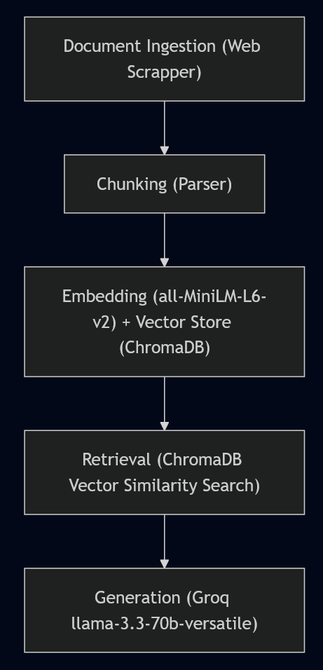

# Project 1 Planning: The Unofficial Guide

> Write this document before you write any pipeline code.
> Your spec and architecture diagram are what you'll use to direct AI tools (Claude, Copilot, etc.) to generate your implementation — the more specific they are, the more useful the generated code will be.
> Update the Retrieval Approach and Chunking Strategy sections if you change your approach during implementation.
> Update this file before starting any stretch features.

---

## Domain

This unofficial guide compiles and makes searchable student reviews, difficulty ratings, and classroom experiences for Computer Science professors at San Jose State University. This specific knowledge is typically fragmented across dozens of individual profile pages, making it difficult to directly compare teaching styles, workload expectations, and grading policies. Centralizing this data allows students to quickly query and cross-reference qualitative insights that are impossible to find in official university course catalogs or by manually clicking through separate review sites.
<!-- What domain did you choose? Why is this knowledge valuable and hard to find through official channels? -->

---

## Documents

<!-- List your specific sources: URLs, subreddit names, forum threads, or file descriptions.
     Aim for at least 10 sources that together cover different subtopics or perspectives within your domain. -->

| # | Source | Description | URL or location |
|---|--------|-------------|-----------------|
| 1 | RMP | Student Reviews of Sayma Akther | https://www.ratemyprofessors.com/professor/2926663 |
| 2 | RMP | Student Reviews of Nada Attar | https://www.ratemyprofessors.com/professor/2445092 |
| 3 | RMP | Student Reviews of Thomas Austin | https://www.ratemyprofessors.com/professor/2000580 |
| 4 | RMP | Student Reviews of Katerina Potika | https://www.ratemyprofessors.com/professor/2099184 |
| 5 | RMP | Student Reviews of Mark Stamp | https://www.ratemyprofessors.com/professor/281383 |
| 6 | RMP | Student Reviews of David Taylor | https://www.ratemyprofessors.com/professor/214947 |
| 7 | RMP | Student Reviews of Mike Wood | https://www.ratemyprofessors.com/professor/2922737 |
| 8 | RMP | Student Reviews of Tahereh Arabghalizi | https://www.ratemyprofessors.com/professor/2926378 |
| 9 | RMP | Student Reviews of Doug Case | https://www.ratemyprofessors.com/professor/3015141 |
| 10 | RMP | Student Reviews of Chung-Wen Tsao | https://www.ratemyprofessors.com/professor/2318479 |

---

## Chunking Strategy

<!-- How will you split documents into chunks?
     State your chunk size (in tokens or characters), overlap size, and explain why those
     numbers fit the structure of your documents.
     A review-heavy corpus warrants different chunking than a long FAQ. -->

**Chunk size:** Chunks will be mapped to individual reviews, not character counts.

**Overlap:** 0. There will be no overlap between chunks since each review is independently written.

**Reasoning:** Since each review is self-contained and written by a different student, often for a different course, using an arbitrary character limit or overlap would lead to different reviews bleeding into each other. Each chunk will also have global metadata (Professor Name, Course) appended to it to ensure it remains retrievable out of context.

---

## Retrieval Approach

<!-- Which embedding model are you using (e.g., all-MiniLM-L6-v2 via sentence-transformers)?
     How many chunks will you retrieve per query (top-k)?
     If you were deploying this for real users and cost wasn't a constraint, what tradeoffs
     would you weigh in choosing a different embedding model — context length, multilingual
     support, accuracy on domain-specific text, latency? -->

**Embedding model:** all-MiniLM-L6-v2 via sentence-transformers

**Top-k:** 5. Since individual reviews are relatively short, fetching 5 chunks will provide the LLM with a diverse set of student opinions to synthesize without overwhelming the prompt context window.

**Production tradeoff reflection:** If deploying to production without cost constraints, I would use an upgraded model, for the increased context window for accessing more chunks, as well as a lower latency for responses.

---

## Evaluation Plan

<!-- List your 5 test questions with their expected correct answers.
     Questions should be specific enough that you can judge whether the system's response
     is right or wrong. "What are good dining halls?" is too vague.
     "What do students say about wait times at [dining hall name] during lunch?" is testable. -->

| # | Question | Expected answer |
|---|----------|-----------------|
| 1 | How difficult are Mark Stamp's courses, and which course is the most difficult? | According to the reviews, the average difficulty of Mark Stamp's courses is a 2.8/5. His most difficult course is CS 166. |
| 2 | How hard of a grader is Tom Austin? | Tom Austin is a lenient grader who is very clear on his grading criteria. |
| 3 | Is it better to take Katerina Potika or Chung-Wen Tsao for my elective? | It is better to take Katerina Potika for your elective, as her take-again percentage is higher at 48% compared to Chung-Wen Tsao's 16%. |
| 4 | What is the average grade in Sayma Akther's classes? | The average grade in Sayma Akther's classes is a B+. |
| 5 | Which professor is best to take for CS 146? | Doug Case is a better professor to take for CS 146, as students say he is a more lenient grader and his lectures are better compared to David Taylor. |

---

## Anticipated Challenges

<!-- What could go wrong? Name at least two specific risks with reasoning.
     Consider: noisy or inconsistent documents, missing source attribution, off-topic
     retrieval, chunks that split key information across boundaries. -->

1. RateMyProfessors uses JavaScript/GraphQL to load user reviews dynamically. Simple HTML scraping will only get the first 20 user reviews, so getting the rest of the reviews might be hard.

2. Many students submit reviews without specifying the exact course code they took. If a user asks a course-specific question the retrieval system might struggle, and the LLM could hallucinate by assigning a generic review to a specific course query.

---

## Architecture

<!-- Draw a diagram of your pipeline showing the five stages:
     Document Ingestion → Chunking → Embedding + Vector Store → Retrieval → Generation
     Label each stage with the tool or library you're using.
     You can use ASCII art, a Mermaid diagram, or embed a sketch as an image.
     You'll use this diagram as context when prompting AI tools to implement each stage. -->

---

## AI Tool Plan

<!-- For each part of the pipeline below, describe:
     - Which AI tool you plan to use (Claude, Copilot, ChatGPT, etc.)
     - What you'll give it as input (which sections of this planning.md, which requirements)
     - What you expect it to produce
     - How you'll verify the output matches your spec

     "I'll use AI to help me code" is not a plan.
     "I'll give Claude my Chunking Strategy section and ask it to implement chunk_text()
     with my specified chunk size and overlap" is a plan. -->

**Milestone 3 — Ingestion and chunking:** I'll give Copilot my Chunking Strategy section and ask it to implement chunk_text().

**Milestone 4 — Embedding and retrieval:** I'll give Copilot my embedding strategy and ask it to implement.

**Milestone 5 — Generation and interface:** I'll have Claude help implement my generation code.
